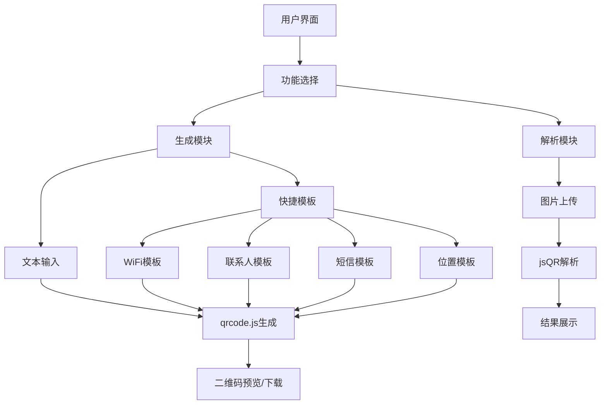
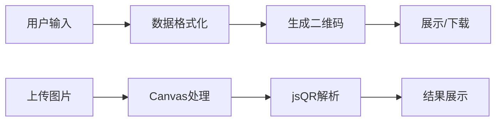

## 产品概述

二维码生成与解析工具，提供便捷的二维码创建和识别功能。用户可以输入文本快速生成二维码，也可以上传二维码图片进行内容解析。工具内置四种常用快捷模板（WiFi、联系人、短信、位置），帮助用户快速生成标准格式的二维码。

## 核心功能

- **文本生成二维码**：输入任意文本内容，实时生成对应二维码图片，支持下载保存
- **图片解析二维码**：上传二维码图片，自动识别并提取二维码中的内容信息
- **WiFi快捷模板**：填写网络名称、密码、加密类型，生成可直接扫描连接的WiFi二维码
- **联系人快捷模板**：输入姓名、电话、邮箱等信息，生成vCard格式联系人二维码
- **短信快捷模板**：填写收件人号码和短信内容，生成一键发送短信的二维码
- **位置快捷模板**：输入经纬度或地址信息，生成地理位置二维码

## 技术栈

- **前端框架**：React + TypeScript
- **样式方案**：Tailwind CSS
- **二维码生成**：qrcode.js 库
- **二维码解析**：jsQR 库
- **状态管理**：React Hooks (useState, useEffect)

## 架构设计

### 系统架构

采用组件化单页应用架构，所有功能在前端完成，无需后端服务。



### 模块划分

| 模块 | 职责 | 技术依赖 |
| --- | --- | --- |
| QRGenerator | 二维码生成核心逻辑 | qrcode.js |
| QRParser | 二维码解析核心逻辑 | jsQR |
| TemplateManager | 快捷模板数据格式化 | - |
| ImageUploader | 图片上传与预处理 | Canvas API |


### 数据流



## 实现细节

### 目录结构

```
src/
├── components/
│   ├── QRGenerator/       # 生成器组件
│   ├── QRParser/          # 解析器组件
│   ├── Templates/         # 快捷模板组件
│   │   ├── WiFiTemplate.tsx
│   │   ├── ContactTemplate.tsx
│   │   ├── SMSTemplate.tsx
│   │   └── LocationTemplate.tsx
│   └── common/            # 通用组件
├── hooks/
│   ├── useQRCode.ts       # 二维码生成Hook
│   └── useQRParser.ts     # 二维码解析Hook
├── utils/
│   ├── qrTemplates.ts     # 模板格式化工具
│   └── imageUtils.ts      # 图片处理工具
└── types/
    └── index.ts           # 类型定义
```

### 核心数据结构

```typescript
// 模板类型定义
interface WiFiData {
  ssid: string;
  password: string;
  encryption: 'WPA' | 'WEP' | 'nopass';
}

interface ContactData {
  name: string;
  phone: string;
  email?: string;
  company?: string;
}

interface SMSData {
  phone: string;
  message: string;
}

interface LocationData {
  latitude: number;
  longitude: number;
  label?: string;
}
```

### 模板格式化规则

- **WiFi**: `WIFI:T:{encryption};S:{ssid};P:{password};;`
- **联系人**: vCard 3.0 格式
- **短信**: `SMSTO:{phone}:{message}`
- **位置**: `geo:{latitude},{longitude}`

## 设计风格

采用现代简约风格，以功能性为导向，界面清晰易用。使用卡片式布局区分不同功能模块，配合柔和的渐变色和圆角设计，营造专业且友好的工具氛围。

## 页面设计

### 主页面布局

页面采用上下结构，顶部为功能切换标签（生成/解析），下方为对应功能区域。

### 生成功能区

- **模式选择栏**：横向排列的模式按钮（自由文本、WiFi、联系人、短信、位置），选中状态有明显高亮
- **输入表单区**：根据选择的模式动态展示对应表单，表单项带有清晰的标签和占位提示
- **预览区**：右侧或下方展示实时生成的二维码，带有下载按钮

### 解析功能区

- **上传区域**：虚线边框的拖拽上传区，支持点击选择文件，带有图标提示
- **结果展示区**：解析成功后显示二维码内容，支持一键复制

### 交互效果

- 模式切换时有平滑过渡动画
- 二维码生成有淡入效果
- 按钮悬停有轻微上浮和阴影变化